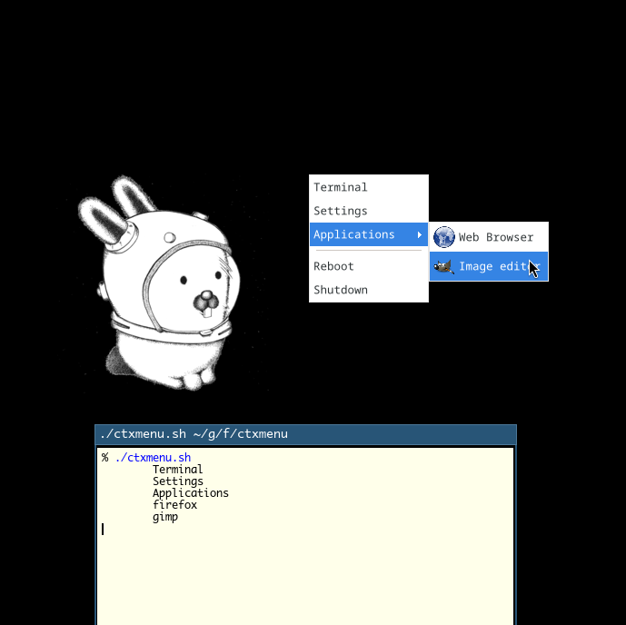
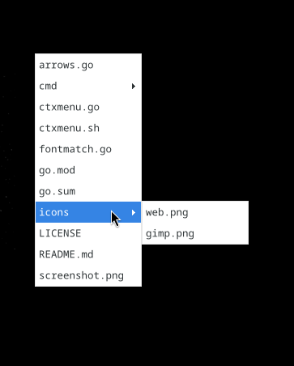

# Context Menu

 

Library and Program for displaying context-menus. It's based on [xmenu](https://github.com/phillbush/xmenu) and rewritten using [Go](https://go.dev/) and [SDL2](https://www.libsdl.org/) (yet). I wanted to make an alternative which does work using Wayland, but there are still some quirks.

## Features

* `ctxmenu`-program which takes stdin and its result to stdout.
* Icons and Separators.
* Keyboard support (in theory, not working in Wayland).
* Mouse support

## Installation

### Requisite

* [**Go**](https://go.dev/doc/install) - The Go Compiler
* [**SDL2**](https://wiki.libsdl.org/SDL2/Installation) and [**SDL2_image**](https://github.com/libsdl-org/SDL_image/tree/SDL2) - A Graphics library
* [**FontConfig**](https://www.freedesktop.org/wiki/Software/fontconfig/) - Find fonts and font-settings (`fc-match`)

### Install using `go install`

Go provides a simple way to install go-programs:
```sh
% go install github.com/friedelschoen/ctxmenu/cmd/ctxmenu@latest
```

Which installs (by default) your application at `~/go/bin`, you might want to add that to `$PATH`.

### Building from source

If you want to build from source, you have to fetch it first:
```sh
% git clone https://github.com/friedelschoen/ctxmenu.git
% cd ctxmenu
% go build -C cmd/ctxmenu -v
```
Which writes `cmd/ctxmenu/ctxmenu`, you now can copy it to your desired location.

## Known Issues

SDL2 is a great library but does not work well under Wayland. Especially using the flag `SDL_POPUP_MENU`, which creates a undecorated and unmanaged window. This is a Xorg-only thing, a Wayland equivalent would be *'wlr-layer-shell'* which is not implemented in Go yet.

Under sway at least, keyboard-focusing is not possible and the program itself can't raise above existing windows. Spawn-at-cursor is not working as an Xorg-program via XWayland only knows the cursor position if is above itself or another Xorg-window. The initial cursor-position (thus the position of the menu) is not the real position but the last position the cursor flew above a Xorg-window.

## License

This project uses the [Zlib License](LICENSE).